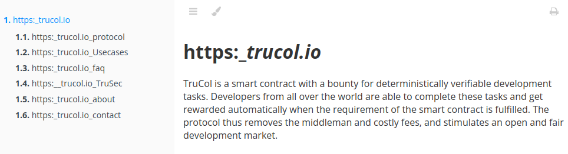
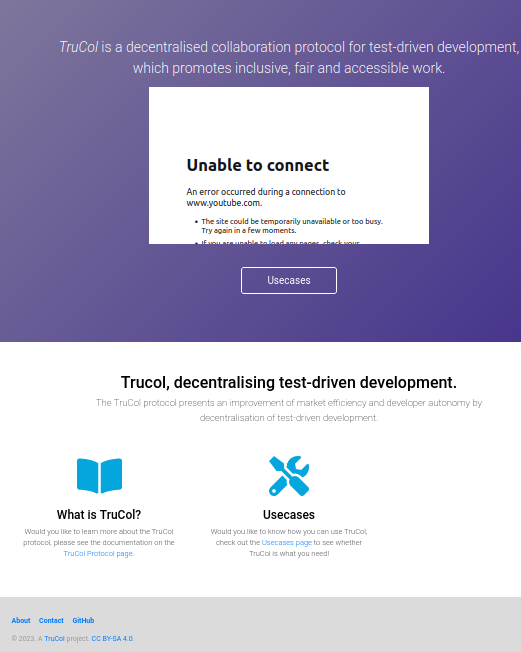
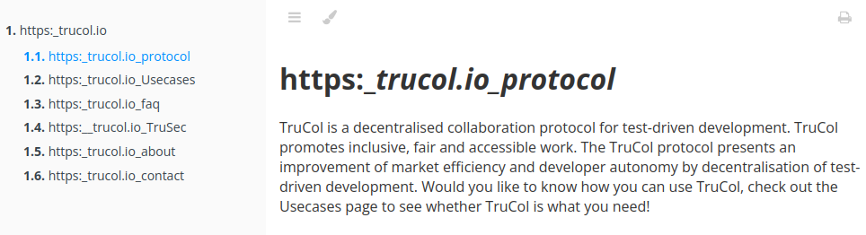
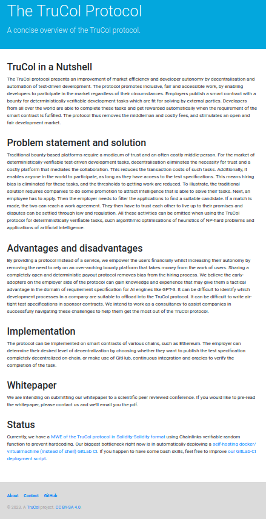

# Studying Companies with Weaviate Summary

[![Python 3.12][python_badge]](https://www.python.org/downloads/release/python-3120/)
[![License: AGPL v3][agpl3_badge]](https://www.gnu.org/licenses/agpl-3.0)
[![Code Style: Black][black_badge]](https://github.com/ambv/black)

Hi! Thanks for checking out this Weaviate workflow that uses the summarise function by Weaviate to speed up studying a company.

- It takes in an url,
- Crawls that entire website for subdomains and stores its content into a json file.
- This json file is then uploaded to your local Weaviate instance.
- Then it uses GraphQL to get summaries of the company website structure.
- This summarised website structure is then reconverted into a simplified mdbook to enable you to quickly develop a broad understanding of a company.
  The summarised webpages are then visualised in a tree structure on a website.

## Usage

To use this code, install the [prerequisites](<>), and run [this](Summarise_website_with_weaviate.ipynb) Jupiter Notebook. Afterwards, you can show your website as summarised by Weaviate with:

```sh
mdbook build &&  mdbook serve
```

(Ps. You can also run `python -m src.pythontemplate` if you prefer CLI over ipynb).

## Example 1

**Before:**



**After:**



## Another example

**Before:**



**After:**



## How can this be made more awesome?

- The tree structure of the website does not yet count the edges, so you could get more insight into the website if the edge thickness represents how often a page is linked to.
- Most of the time, it is not just the raw data you want from a company website but the secondary (or ternary) insights gained in processing that data and/or combining it with other relevant or recent developments. This is where Weaviate may shine, as it supports enhancing your own databases in combination with LLMs. A guided structure may be set up to facilitate this.

[agpl3_badge]: https://img.shields.io/badge/License-AGPL_v3-blue.svg
[black_badge]: https://img.shields.io/badge/code%20style-black-000000.svg
[python_badge]: https://img.shields.io/badge/python-3.6-blue.svg
